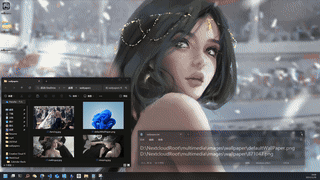
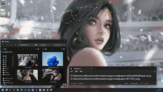
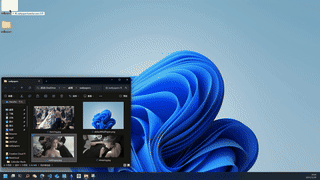
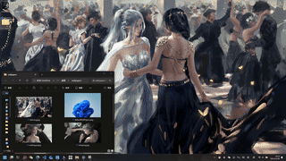
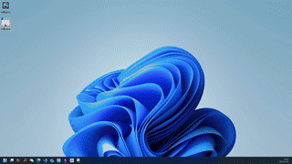

# Wallpaper Switcher
## Demo

## Intro
I love to use cartoon images to be my wallpapers. However, sometimes it would be awkard to show it in front of your audience during the acadamic presentation. Therefore, I made this little tool to save my life.

>[!caution] 
> - **Only support for windows**
> - **Always backup your current wallpaper before use it.**

## Installation
### Download portable exe
- check the [lateset release](https://github.com/idlesilver/wallpaperSwitcher/releases/tag/v1.0) for the `wallpaperSwitcher.exe`

### Build from source
- Install python environment. Google it if you don't have one.
- install pywin32 package with `pip install pywin32`
- install pyinstaller package with `pip install pyinstaller`
- Clone repo, or download and decompression [source zip](https://github.com/idlesilver/wallpaperSwitcher/releases/download/v1.0/wallpaperSwitcher.zip)
- Enter the decompression folder and compile the exe file by `pyinstaller --onefile --noconsole --icon=wallpaper.ico .\setWallpaper.py`
  - You can modify the icon and scripts as you like
  - The exe file should be in `dist` folder, you can move it to any where as you like

## Usage
1. Double click to rotately switching between the given wallpaper list, wallpaper list can be defined by
   1. image path list in wallpaper.txt with 
   2. image in the folder named wallpapers
   3. image paths given in `default_wallpaper_files` in script
2. Drag an image to set as wallpaper, or
3. Drag any non-image-type file to it to manually select wallpaper

`wallpaper.txt` and `wallpapers` folder should be in the same location as the exe file or the python script

## More demos
### Rotate images in list

### Rotate images in folder

### Drag image files

### Drag non-image files to trigger image select

### Rotate image in default list

